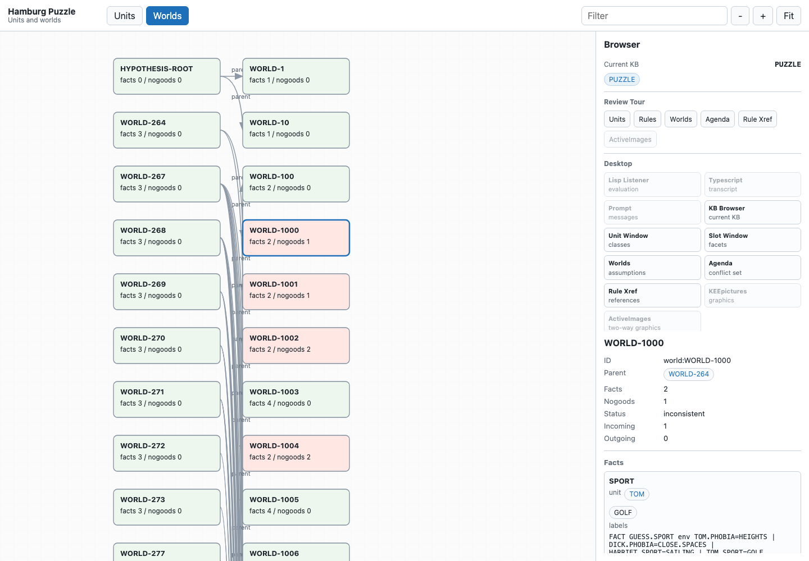
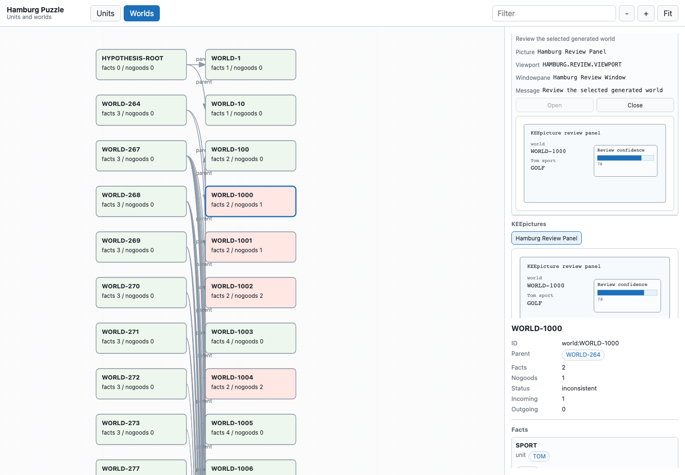
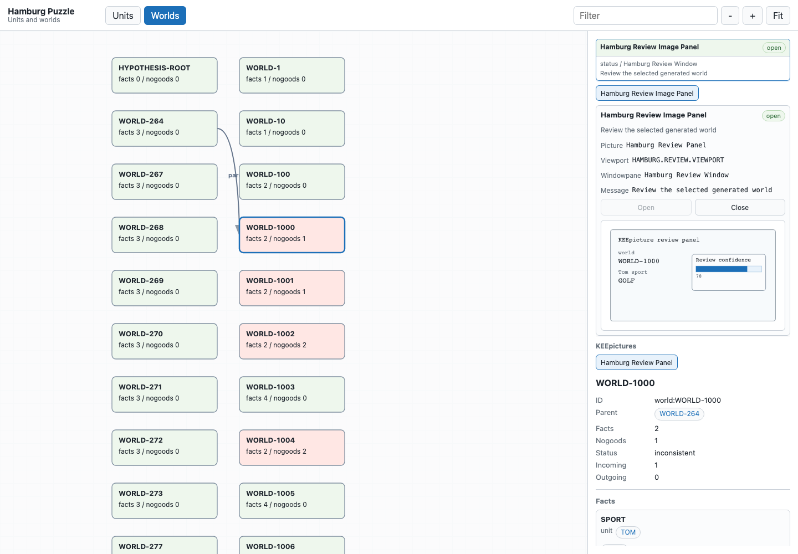

# KEE Reconstruction

An evidence-first reconstruction of IntelliCorp's Knowledge Engineering
Environment (KEE).







This is not original IntelliCorp KEE source. It is a clean-room reconstruction
of selected behavior, built from public evidence and runnable experiments.

This repository is being developed collaboratively by Carlos Vaz and OpenAI
Codex. Codex has generated substantial portions of the implementation,
documentation, scripts, and tests under human direction. The standard here is
evidence plus verification, not hand-authorship.

This project is deliberately split into two tracks:

- `docs/`: provenance, recovered API notes, and design decisions.
- `src/` and `test/`: a Common Lisp reconstruction, starting with the KEE
  object/slot/message core.

`docs/gui-reconstruction.md` tracks the recovered KEE browser, Common Windows,
KEEpictures, ActiveImages, and trace/debugging evidence that guides the GUI
work.

The rule here is simple: public evidence first, implementation second. When
the original behavior is unknown, we record the uncertainty instead of quietly
inventing history.

## Try The Demo

With Nix:

```sh
nix develop --command scripts/render-demo.sh
```

Then open `demo/hamburg-viewer.html` in a browser.

The current demo is a standalone Hamburg puzzle viewer. It is not the original
KEE GUI, but it gives a concrete surface for reviewing reconstructed units,
slots, rule classes, generated worlds, trace events, assumptions, support
labels, nogood explanations, KEEpictures, image panels, and ActiveImages.

Useful follow-up commands:

```sh
nix develop --command scripts/screenshot-demo.sh
nix develop --command scripts/check-viewer.sh
nix develop --command scripts/smoke.sh
```

See `docs/demo.md` for the demo path, `docs/reviewer-packet.md` for a guided
first look, and `docs/expert-review.md` for the questions this repo is now
prepared to ask people who used KEE professionally.

## Repository Knowledge

This project follows a lightweight harness-engineering style: keep repository
knowledge local, structured, and executable so both humans and agents can
reason about it.

- `AGENTS.md` is the short map for future Codex work.
- `docs/artifacts.md` is the evidence ledger and missing-artifact list.
- `docs/provenance-policy.md` explains what can be checked in.
- `docs/agent-workflow.md` records the repo-local agent workflow.
- `docs/reviewer-packet.md` is the short guided path for first-hand reviewers.
- `docs/gui-reconstruction.md` tracks the historically important GUI layer.
- `docs/gui-fidelity-matrix.md` maps GUI evidence to implementation status.

## Current Scope

The first implementation target is `kee-core`:

- knowledge bases
- units with `subclass` and `member` parent links
- slots with local, inherited, and combined values
- basic inherited value propagation
- KEE-style API names such as `create.unit`, `get.value`, `put.value`,
  `unit.parents`, `unit.children`, and `unitmsg`
- method slots with `:before`, `:primary`, and `:after` contributions
- textual method trace events for `unitmsg` dispatch, contribution calls, and
  returns
- first-pass ActiveValue hooks on slot read/write/add/remove
- first-pass ActiveImage units bound to ordinary unit slots, with HTML
  fragments for button, gauge/thermometer, switch, histogram, and plot widgets
  plus optional write-back through `put.value`
- first-pass KEEpicture units with contained rectangle, text, slot-value, and
  embedded ActiveImage items, reconstructed viewport/windowpane units,
  mouse-event traces, and SVG previews through `kee.picture.svg`
- first-pass image/workflow panel units over KEEpictures and windowpanes, with
  `open-panel!`, `close-panel!`, `open!`, and `close!` message methods,
  panel open/close traces, and viewer panel previews with local open/close
  controls
- readable knowledge-base dumps with `dump.kb`, `write.kb.dump`,
  `read.kb.dump`, `load.kb.dump`, and file helpers, preserving units, parent
  links, local slots, facets, unit references, ActiveImage units, and
  KEEpicture/panel units
- value-class and cardinality facets such as `(one.of ...)`,
  `min.cardinality`, and `max.cardinality`
- a tiny RuleSystem subset with rule units, `external.form`, `parse`,
  `parse.errors`, `THE`/`OF`/`IS`, `LISP`, `THEN`, `IN.NEW.WORLD`, and
  `forward.chain`
- a tiny KEEworlds subset with world overlays, first-pass active environment
  assumptions, current fact support labels, label retraction traces, nogood
  environment snapshots, and `BELIEVE FALSE`
- small world-search helpers: `cant.find`, `find.any`, `run.world.agenda`, and
  effective-fact deduplication for generated worlds
- structured trace events for world creation, slot writes, agenda passes, rule
  matches/firings, branch creation, nogoods, and contradictions, with
  agenda/activation/fire provenance IDs through `trace.events` and
  `clear.trace.events`
- a first static rule cross-referencer through `rule.references` and
  `rule.reference.index`, covering `THE`, common slot accessor/mutator calls,
  `IN.NEW.WORLD`, and `BELIEVE`
- structured inspector helpers and a compact terminal browser, including
  `list.kbs`, `list.units`, `inspect.unit`, `inspect.slot`, `inspect.world`,
  `inspect.world.tree`, `print.browser`, `browser.command`, and `browse`
- structured unit/world graph exports and Graphviz DOT renderers, including
  `unit.graph`, `world.graph`, `unit.graph.dot`, and `world.graph.dot`
- standalone HTML/SVG graph viewer generation through `kee.viewer.html` and
  `write.kee.viewer.html`, with visible current-KB state, loaded-KB chips, a
  class/member hierarchy browser, synchronized slot table, Review Tour
  controls, a reconstructed Desktop roster with Listener/Typescript/Prompt
  transcript panes, embedded KEEpicture previews, embedded ActiveImage
  controls with local static-page updates, reconstructed image-panel previews,
  searchable node browser, and a
  clickable inspector for slots, facets, facts, nogood explanations, and
  in-graph references, rule cross-reference panes with operation/slot/target
  filters, plus trace panes filterable by family, event kind, selected-node
  scope, and search text, with
  previous/next trace jumps, focused trace detail, a compact
  agenda/conflict-set pane with candidate/fired-rule jump controls plus
  condition/action/effect drilldowns, a provenance-backed causality graph,
  selected world/fact/problem why trails, alternative-world assumption
  summaries, clickable trace references and focused-trace graph targets,
  graph/path highlighting for focused traces, a spatial trace map with
  speed/loop replay controls and focused-branch emphasis, and a compact trace
  graph

Later phases broaden RuleSystem/TellAndAsk, grow the KEEworlds/ATMS model, and
add the Common Windows / KEEpictures / ActiveImages GUI layer.

## Examples

`examples/veg-mini.lisp` is a small executable specimen inspired by the NASA
VEG listings. It creates a `veg` KB, a `target.data` class, sample/wavelength
units, and a method invoked with `unitmsg`.

`examples/veg-rule-mini.lisp` adds a VEG-style rule that selects a technique
for a wavelength unit using `forward.chain`.

`examples/hamburg-puzzle-mini.lisp` demonstrates KEE 3.0 training-slide-style
constraints and hypothesis search. It marks impossible worlds inconsistent,
prints a nogood reason, branches missing sports/phobias with `IN.NEW.WORLD`,
and lists complete consistent candidate worlds.

`examples/kee-browser.lisp` prints a small terminal browser view over the
Hamburg puzzle KB: selected units, slot/facet summaries, generated worlds, and
contradiction reasons. This is the first foundation for reconstructing the
KEE browser/GUI layer.

`examples/kee-browser-shell.lisp` sets up the same puzzle and opens a small
form-oriented browser shell. Useful commands include `(help)`, `(kbs)`,
`(units puzzle)`, `(unit tom)`, `(slot tom sport)`, `(dump-kb puzzle)`,
`(write-dump "puzzle.kdump" puzzle)`, `(load-dump "puzzle.kdump" :replace t)`,
`(worlds 8)`, and `(quit)`.

`examples/kee-graph-dot.lisp` emits DOT graphs for the Hamburg puzzle's unit
hierarchy and generated worlds. The browser shell can also print DOT with
`(unit-graph)` and `(world-graph 20)`.

`examples/kee-graph-viewer.lisp` emits a standalone HTML/SVG graph browser for
the Hamburg puzzle. The browser shell can also print one with `(viewer 40)`.

`examples/active-image-mini.lisp` creates a slot-bound ActiveImage gauge,
embeds it in a small reconstructed KEEpicture and image panel, renders
HTML/SVG fragments, and updates the target slot through the ActiveImage so
ActiveValue write hooks still run.

`examples/kb-dump-mini.lisp` writes a readable reconstructed KB dump, reloads
it, and checks that units, facets, ActiveImages, KEEpicture items, and image
panels survived the round trip. `scripts/render-demo-dump.sh` regenerates the
checked-in
`docs/assets/dumps/delivery.kdump` artifact, which can be inspected directly or
loaded from the browser shell, for example with
`(load-dump "docs/assets/dumps/delivery.kdump" :replace t)`.

## Running Tests

```sh
sbcl --script test/run-tests.lisp
```

Or with the dev shell:

```sh
nix develop --command scripts/check-viewer.sh
nix develop --command scripts/smoke.sh
```
